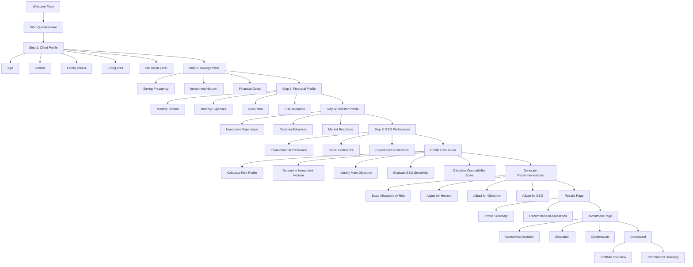

# Tawfir.AI Questionnaire Flow

This document describes the questionnaire flow in the Tawfir.AI application, which is used to build a user's investment profile.

## Questionnaire Sections

### 1. Client Profile
- **Purpose:** Establish basic demographic information
- **Key Questions:**
  - Age (age groups: 18-25, 26-35, 36-45, 46-55, 56+)
  - Gender (male, female, prefer not to say)
  - Family status (single, couple, with children)
  - Living area (urban, suburban, rural)
  - Education level (primary, secondary, higher, professional)

### 2. Saving Profile
- **Purpose:** Understand saving habits and financial goals
- **Key Questions:**
  - Saving frequency (never, occasional, monthly, automatic)
  - Investment horizon (slider: 0-10+ years)
  - Financial goals (multiple selection: real estate, retirement, security fund, personal projects)

### 3. Financial Profile
- **Purpose:** Assess financial capacity and risk tolerance
- **Key Questions:**
  - Monthly income (income brackets)
  - Monthly expenses (expense brackets)
  - Debt ratio (low, medium, high)
  - Risk tolerance (based on reaction to investment loss)

### 4. Investor Profile
- **Purpose:** Determine experience level and decision-making tendencies
- **Key Questions:**
  - Investment experience (beginner to expert)
  - Decision behaviors (professional advice, research, trends, intuition)
  - Market reactions (panic, worry, calm, opportunity)

### 5. ESG Preferences
- **Purpose:** Align investments with personal values
- **Key Questions:**
  - Environmental importance (slider: 0-10)
  - Social importance (slider: 0-10)
  - Governance importance (slider: 0-10)

## Profile Calculation Process

After collecting all responses, the system:

1. **Calculates Risk Profile** based primarily on risk tolerance answers:
   - Conservateur (Conservative): Prioritizes capital protection
   - Modéré (Moderate): Balance between growth and protection
   - Dynamique (Dynamic): Prioritizes growth, accepts volatility

2. **Determines Investment Horizon** based on the time horizon slider:
   - Court terme (Short term): 0-3 years
   - Moyen terme (Medium term): 3-7 years
   - Long terme (Long term): 7+ years

3. **Identifies Main Objective** by prioritizing selected financial goals:
   - Achat immobilier (Real estate purchase)
   - Préparation retraite (Retirement planning)
   - Fonds de sécurité (Security fund)
   - Projets personnels (Personal projects)

4. **Evaluates ESG Sensitivity** based on average of ESG sliders:
   - Faible (Low): 0-3 average
   - Modérée (Moderate): 3-7 average
   - Élevée (High): 7-10 average

5. **Calculates Compatibility Score** using a proprietary algorithm (85-99%)

## Recommendation Engine Logic

The system generates personalized investment recommendations through these steps:

1. **Basic Allocation by Risk Profile:**
   - Conservative: Higher allocation to secure products (40% Livret, 30% Obligations)
   - Moderate: Balanced allocation (40% Livret, 30% Fonds diversifié)
   - Dynamic: Higher allocation to growth assets (40% Fonds diversifié, 30% Actions ESG)

2. **Adjusting for Investment Horizon:**
   - Longer horizons increase allocation to higher-risk/higher-return products
   - Shorter horizons favor more secure, liquid investments

3. **Adjusting for Main Objective:**
   - Real estate objectives increase allocation to real estate savings plans
   - Retirement objectives favor long-term growth investments

4. **Adjusting for ESG Sensitivity:**
   - Higher ESG sensitivity increases allocation to ESG-focused products
   - Ensures the final allocation adds up to 100%