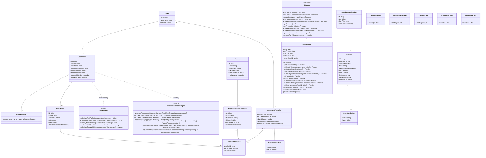

```mermaid
classDiagram
    %% User Management
    class User {
        +id: number
        +username: string
        +password: string
    }

    class UserProfile {
        +id: string
        +userId: string
        +riskProfile: string
        +investmentHorizon: string
        +mainObjective: string
        +esgSensitivity: string
        +compatibilityScore: number
        +answers: UserAnswers
    }

    class UserAnswers {
        +[questionId: string]: string|string[]|number|boolean
    }

    %% Product Management
    class Product {
        +id: string
        +name: string
        +description: string
        +riskLevel: string
        +expectedReturn: string
        +minInvestment: number
    }

    class ProductRecommendation {
        +id: string
        +name: string
        +description: string
        +riskLevel: string
        +percentage: number
        +expectedReturn: string
    }

    class ProductAllocation {
        +productId: string
        +percentage: number
        +amount: number
    }

    %% Investment Management
    class Investment {
        +id: string
        +userId: string
        +amount: number
        +date: string
        +status: string
        +allocations: ProductAllocation[]
    }

    class InvestmentPortfolio {
        +totalAmount: number
        +globalPerformance: number
        +dailyChange: number
        +allocations: ProductAllocation[]
        +performanceData: PerformanceData[]
    }

    class PerformanceData {
        +month: string
        +value: number
    }

    %% Questionnaire
    class QuestionnaireSection {
        +id: string
        +title: string
        +shortTitle: string
        +questions: Question[]
    }

    class Question {
        +id: string
        +question: string
        +description: string
        +type: string
        +options: QuestionOption[]
        +min: number
        +max: number
        +leftLabel: string
        +rightLabel: string
        +placeholder: string
    }

    class QuestionOption {
        +value: string
        +label: string
    }

    %% Services
    class IStorage {
        <<interface>>
        +getUser(id: number): Promise<User>
        +getUserByUsername(username: string): Promise<User>
        +createUser(user: InsertUser): Promise<User>
        +getUserProfile(userId: string): Promise<UserProfile>
        +createOrUpdateUserProfile(profile: InsertUserProfile): Promise<UserProfile>
        +getProducts(): Promise<Product[]>
        +getProduct(id: string): Promise<Product>
        +createProduct(product: InsertProduct): Promise<Product>
        +createInvestment(investment: InsertInvestment): Promise<Investment>
        +getUserInvestments(userId: string): Promise<Investment[]>
        +getUserPortfolio(userId: string): Promise<any>
    }

    class MemStorage {
        -users: Map<number, User>
        -userProfiles: Map<string, UserProfile>
        -products: Map<string, Product>
        -investments: Map<string, Investment>
        +currentUserId: number
        +constructor()
        +getUser(id: number): Promise<User>
        +getUserByUsername(username: string): Promise<User>
        +createUser(user: InsertUser): Promise<User>
        +getUserProfile(userId: string): Promise<UserProfile>
        +createOrUpdateUserProfile(profile: InsertUserProfile): Promise<UserProfile>
        +getProducts(): Promise<Product[]>
        +getProduct(id: string): Promise<Product>
        +createProduct(product: InsertProduct): Promise<Product>
        +createInvestment(investment: InsertInvestment): Promise<Investment>
        +getUserInvestments(userId: string): Promise<Investment[]>
        +getUserPortfolio(userId: string): Promise<any>
        -initializeSampleProducts(): void
        -getDemoPortfolio(): any
    }

    %% Utility Classes
    class ProfileUtils {
        <<static>>
        +calculateRiskProfile(answers: UserAnswers): string
        +determineInvestmentHorizon(answers: UserAnswers): string
        +identifyMainObjective(answers: UserAnswers): string
        +evaluateESGSensitivity(answers: UserAnswers): string
        +calculateCompatibilityScore(answers: UserAnswers): number
    }

    class RecommendationEngine {
        <<static>>
        +generateRecommendations(profile: UserProfile): ProductRecommendation[]
        -allocateConservative(products: Product[]): ProductRecommendation[]
        -allocateModerate(products: Product[]): ProductRecommendation[]
        -allocateDynamic(products: Product[]): ProductRecommendation[]
        -adjustForHorizon(recommendations: ProductRecommendation[], horizon: string): ProductRecommendation[]
        -adjustForObjective(recommendations: ProductRecommendation[], objective: string): ProductRecommendation[]
        -adjustForESG(recommendations: ProductRecommendation[], sensitivity: string): ProductRecommendation[]
    }

    %% UI Components
    class WelcomePage {
        +render(): JSX
    }

    class QuestionnairePage {
        +render(): JSX
    }

    class ResultsPage {
        +render(): JSX
    }

    class InvestmentPage {
        +render(): JSX
    }

    class DashboardPage {
        +render(): JSX
    }

    %% Relationships
    User "1" -- "1" UserProfile
    UserProfile "1" -- "1..*" UserAnswers
    UserProfile "1" -- "0..*" Investment
    User "1" -- "0..1" InvestmentPortfolio
    
    Product "1..*" -- "0..*" ProductRecommendation
    ProductRecommendation "1..*" -- "0..*" ProductAllocation
    
    Investment "1" -- "1..*" ProductAllocation
    InvestmentPortfolio "1" -- "1..*" ProductAllocation
    InvestmentPortfolio "1" -- "1..*" PerformanceData
    
    QuestionnaireSection "1..*" -- "1..*" Question
    Question "1" -- "0..*" QuestionOption
    
    IStorage <|-- MemStorage
    
    UserProfile .. ProfileUtils: calculated by
    UserProfile .. RecommendationEngine: used by
```